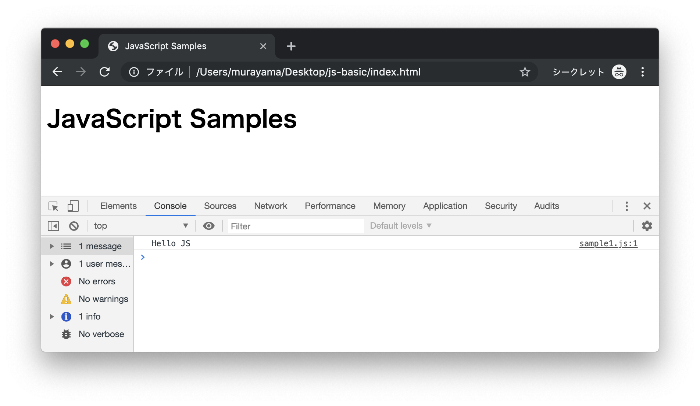
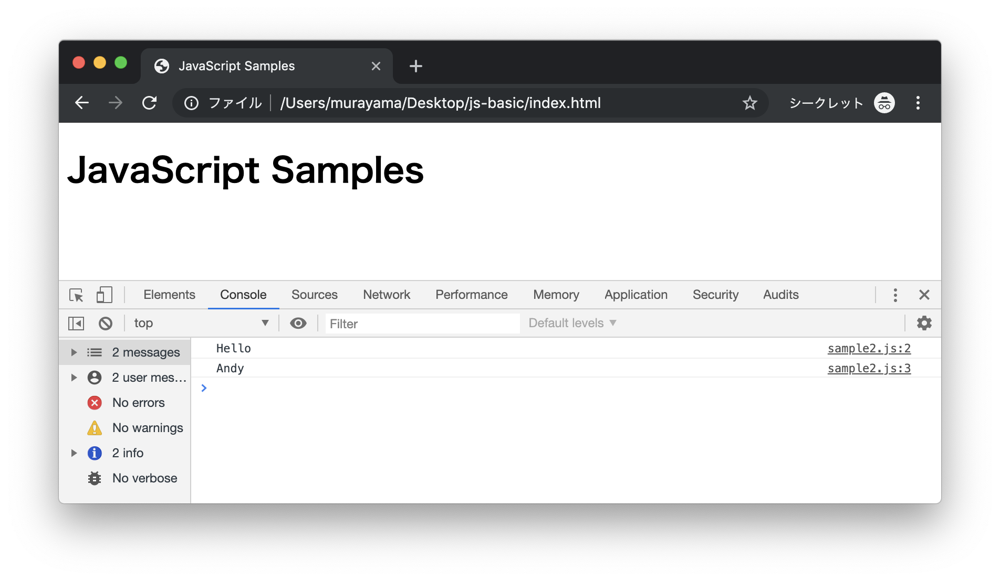
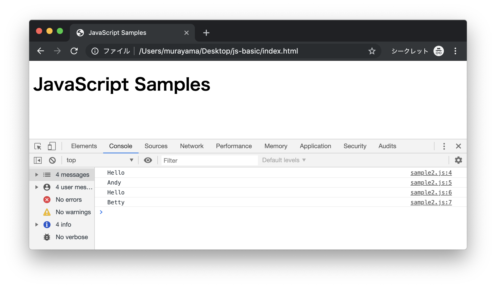
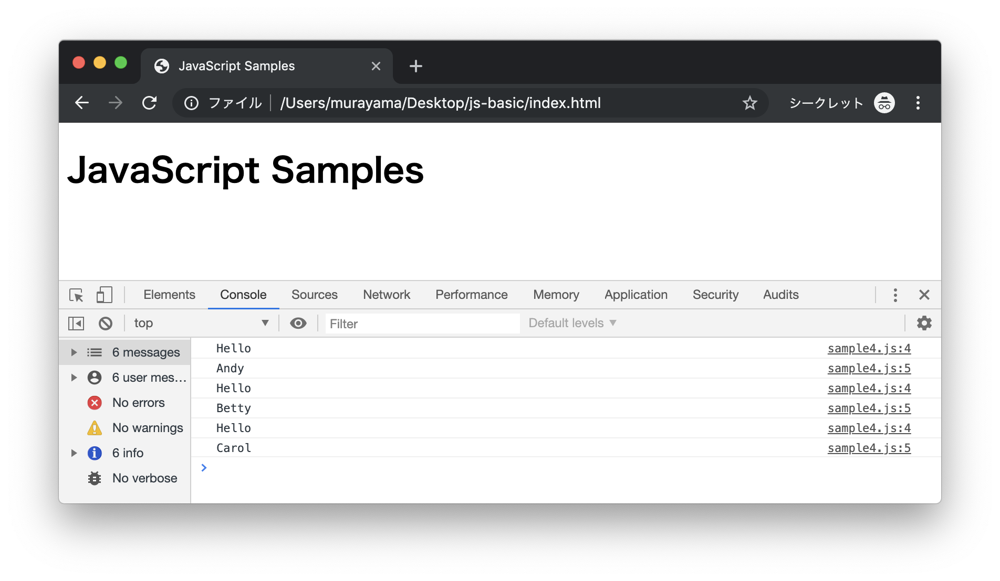
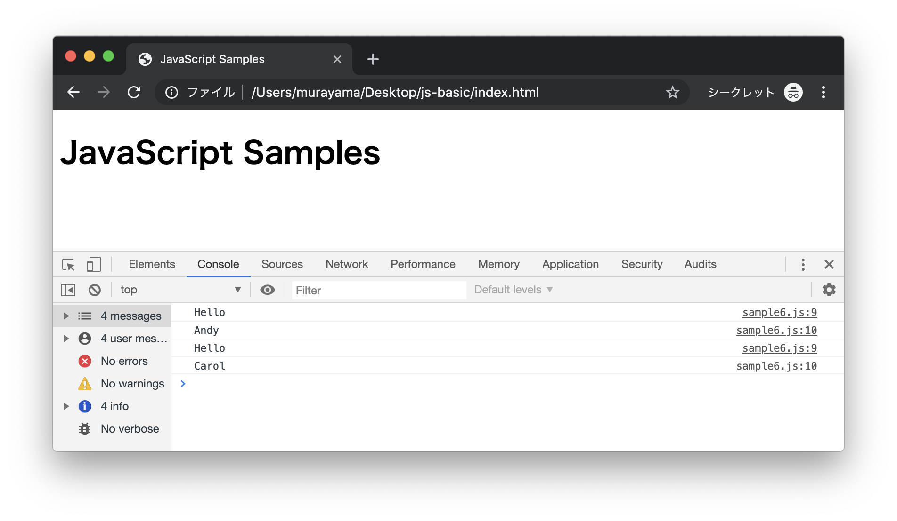
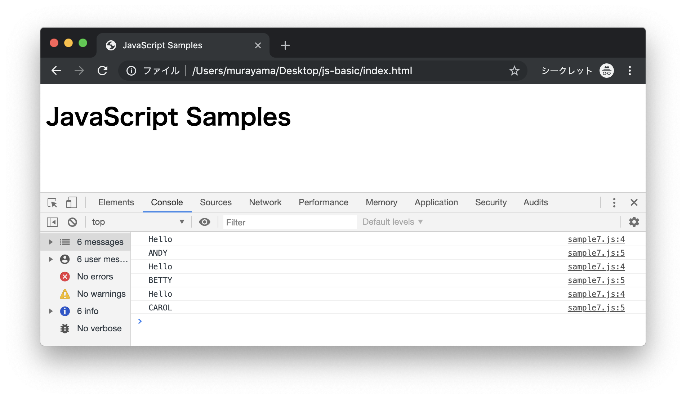
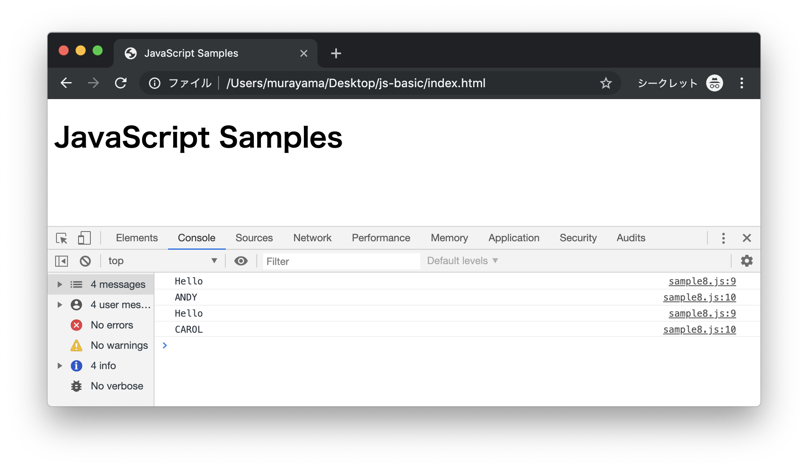

# JavaScript入門

## サンプルプログラム

ここでは以下のサンプルプログラムを取り上げます。最速で。

1. データの出力
1. 変数
1. 配列
1. 制御構文（for文）
1. 制御構文（if文）
1. オブジェクト
1. メソッド
1. まとめ

プログラミング初学者にとっては配列や関数など躓きやすいポイントがいくつかありますが、上から順番に学習を進めていけばどこが苦手かチェックできると思います。

## 1 データの出力（sample1.js）

次のプログラムはブラウザのコンソールに`Hello JS`と出力するプログラムです。ファイル名は`sample1.js`として任意のフォルダに保存します。

> 以降のサンプルプログラムはMac上で`/Users/murayama/Desktop/js-basic`フォルダに保存したものとします。

```JS
console.log("Hello JS");
```

次に上記のJavaScriptプログラムをロードするHTMLファイルを作成します。

```html
<!DOCTYPE html>
<html lang="ja">
  <head>
    <meta charset="utf-8">
    <title>JavaScript Samples</title>
    <script src="sample1.js"></script>
  </head>
  <body>
    <h1>JavaScript Samples</h1>
  </body>
</html>
```

JavaScriptでブラウザコンソールにデータを出力するには`console.log`メソッドを使います。上記のように記述すればChromeのデベロッパーツールに`Hello JS`と出力されます。



## 2 変数（sample2.js）

続いて変数を扱うプログラムについて見てみましょう。変数とはプログラム上でデータを扱う仕組みです。次のプログラムを`sample2.js`という名前で保存します。

```JS
var name = "Andy";
console.log("Hello");
console.log(name);
```

JavaScriptの変数は`var`キーワードを付けて宣言します。ここでは変数`name`を定義しています。また変数`name`の中に`"Andy"`という文字列データを代入しています。

> 変数宣言時にはvarキーワード以外にもconstキーワードやletキーワードも利用できます。何も付けなかった場合はグローバル変数のように振る舞います。

JavaScriptの文字列データは`""`（ダブルクォーテーション）あるいは`''`（シングルクォーテーション）で囲む必要があります。変数に格納したデータは`console.log`メソッドで出力できます。

> 文字列の定義に\`\`バッククォートを使うこともできます。バッククォートで定義したｔ文字列の中で変数を展開したり、改行したりできます。

それでは作成したプログラムを実行してみましょう。index.htmlファイルから参照するJavaScriptプログラムをsample2.jsに変更します。

```html
<!DOCTYPE html>
<html lang="ja">
  <head>
    <meta charset="utf-8">
    <title>JavaScript Samples</title>
    <script src="sample2.js"></script>
  </head>
  <body>
    <h1>JavaScript Samples</h1>
  </body>
</html>
```



ブラウザでindex.htmlを表示すると、上記のように出力されればOKです。


もう一つ変数を扱うサンプルプログラムを考えてみましょう。先ほどのプログラムは`Hello Andy`と出力しましたが、もう一人、登場人物として`"Betty"`を追加してみましょう。先ほどのプログラム`sample2.js`を修正します。

```JS
var name = "Andy";
var name2 = "Betty";

console.log("Hello");
console.log(name);
console.log("Hello");
console.log(name2);
```

変数が`name`と`name2`の2つになりました。変数`name`には`"Andy"`、`name2`には`"Betty"`がそれぞれ代入されています。

それでは作成したプログラムをブラウザで表示してみましょう。



上記のように画面に出力されればOKです。

ところでもう一人名前の出力を追加する場合はどうでしょうか。`"Andy"`、`"Betty"`、`"Carol"`のように名前を追加していくと、変数の数も多くなってしまいます。


## 3 配列（sample3.js）

続いて配列を扱うプログラムについて見てみましょう。配列は変数の一種で、関係性のある複数のデータをまとめて管理する仕組みです。たとえば先ほどの`"Andy"`、`"Betty"`、`"Carol"`のような名前を表すデータは配列で管理すると簡単になります。次のプログラムを`sample3.js`という名前で保存します。


```JS
var names = ["Andy", "Betty", "Carol"];

console.log("Hello");
console.log(names[0]);
console.log("Hello");
console.log(names[1]);
console.log("Hello");
console.log(names[2]);
```

変数`names`には`"Andy"`、`"Betty"`、`"Carol"`と3つのデータが代入されています。このように複数のデータをまとめて管理する仕組みを配列と呼びます。配列は前から順番に要素番号が割り振られます。また要素番号の先頭は`1`ではなく`0`から始まる点に注意しておきましょう。

> 変数名が`names`と複数形になっている点も注目してください。配列のような複数のデータを表現する変数は名前の付け方を工夫すると読みやすくなります。

それでは作成したプログラムをブラウザで表示してみましょう。

> index.htmlファイルから参照するJavaScriptプログラムをsample3.jsに変更します。


上記のように出力されればOKです。

## 4 制御構文（for文）（sample4.js）

配列のような集合データはfor文などの繰り返し構造を使えば簡単に出力できます。次のプログラムを`sample4.js`という名前保存します。

```JS
var names = ["Andy", "Betty", "Carol"];

for (var i = 0; i < 3; i++) {
  console.log("Hello");
  console.log(names[i]);
}
```

ここで繰り返し構造である`for`文は変数`i`の値が`0`から`3`まで（計3回）処理を繰り返します。

> for文で扱う変数`i`はカウンター変数などと呼ばれます。変数`i`のiはincrement（増える）という単語の頭文字を意味しています。`for (var i = 0; i < 3; i++)`とすると、変数`i`の初期値は0となり、`i < 3`の条件が成立する間、処理（forの後の`{}`）を繰り返します。繰り返しが1回終了するごとに`i++`が実行されます。`i++`は`i`の値を`1`増やすという処理なので、繰り返しの都度、変数`i`の値が1増えることになります。

それでは作成したプログラムをブラウザで表示してみましょう。

> index.htmlファイルから参照するJavaScriptプログラムをsample4.jsに変更します。




上記のように画面に出力されればOKです。

## 5 制御構文（if文）（sample5.js）

さきほどのプログラムを少し修正してみましょう。ここでは`if`文を使って`"Andy"`、`"Betty"`、 `"Carol"` 3人の名前の中から`"Andy"`以外の名前を出力するように修正してみましょう。次のプログラムをsample5.jsという名前保存します。

```JS
var names = ["Andy", "Betty", "Carol"];

for (var i = 0; i < 3; i++) {
  if (names[i] != "Andy") {
    console.log("Hello");
    console.log(names[i]);
  }
}
```

for文の中で、if文を使って変数（`names[i]`）の値が`"Andy"`でないか確認しています。

> if文で利用している演算子`!=`は左辺と右辺が等しくない場合に真（True）となります。等しいかどうかを比較する場合は`==`を使います。`!==`や`===`といった演算子も大切ですが、もう少しあとで勉強しましょう。

それでは作成したプログラムをブラウザで表示してみましょう。

> index.htmlファイルから参照するJavaScriptプログラムをsample5.jsに変更します。


上記のように画面に出力されればOKです。

## 6 オブジェクト（sample6.js）

少し複雑なプログラムも見てみましょう。ここでは`"Andy"`、`"Betty"`、`"Carol"` 3人のデータに対して`"Andy"`は`20`歳、`"Betty"`は`19`歳、`"Carol"`は`21`歳のように、年齢（`age`）データも定義します。また出力の条件も変更して、年齢が`20`歳以上であれば`Hello `と出力するように修正してみましょう。次のプログラムを`sample6.js`という名前保存します。


```JS
var students = [
  {"name": "Andy", "age": 20},
  {"name": "Betty", "age": 19},
  {"name": "Carol", "age": 21}
];

for (var i = 0; i < 3; i++) {
  if (students[i]["age"] >= 20) {
    console.log("Hello");
    console.log(students[i]["name"]);
  }
}
```

オブジェクトは`{}`を使って定義します。通常の配列は前から順番に要素番号が割り振られるのに対して、オブジェクトは要素番号ではなく、キー（`"name"`や`"age"`のような文字列）と値を割り振ります。また`for`文の中で、`if`文を使って変数`names[i]["age"]`の値が`20`以上かどうか確認しています。

それでは作成したプログラムをブラウザで表示してみましょう。

> index.htmlファイルから参照するJavaScriptプログラムをsample6.jsに変更します。



上記のように画面に出力されればOKです。

> オブジェクトにはデータだけでなくメソッドを定義することもできます。

## 7 メソッド（sample7.js）

続いて本講座では関数について取り上げます。関数を使うサンプルプログラムを見てみましょう。次のプログラムは`strtoupper`関数を使って`"Andy"`、`"Betty"`、`"Carol"`3人の名前をアルファベット大文字で出力します。次のプログラムを`sample7.js`という名前保存します。

```JS
var names = ["Andy", "Betty", "Carol"];

for (var i = 0; i < 3; i++) {
  console.log("Hello");
  console.log(names[i].toUpperCase());
}
```

`for`文の繰り返し処理の中で`toUpperCase`メソッドを利用しています。`toUpperCase`メソッドは`names[i]`に代入されている文字列を大文字に変換します。

それでは作成したプログラムをブラウザで表示してみましょう。

> index.htmlファイルから参照するJavaScriptプログラムをsample7.jsに変更します。



上記のように画面に出力されればOKです。

> アルファベット小文字に変換するにはtoLowerCaseメソッドを使います。

## 8 まとめ（sample8.js）

それではこれまでのまとめとして、配列やオブジェクト、制御構造（`for`文や`if`文）、それからメソッド（`String#toUpperCase`）を使うプログラムを作成してみましょう。次のプログラムを`sample8.js`という名前保存します。

```JS
var students = [
  {"name": "Andy", "age": 20},
  {"name": "Betty", "age": 19},
  {"name": "Carol", "age": 21}
];

for (var i = 0; i < 3; i++) {
  if (students[i]["age"] >= 20) {
    console.log("Hello");
    console.log(students[i]["name"].toUpperCase());
  }
}
```

それでは作成したプログラムをブラウザで表示してみましょう。

> index.htmlファイルから参照するJavaScriptプログラムをsample8.jsに変更します。



上記のように画面に出力されればOKです。

## おわりに

以上、駆け足でJavaScriptプログラミングについて紹介しました。

1. データの出力
1. 変数
1. 配列
1. 制御構文（for文）
1. 制御構文（if文）
1. オブジェクト
1. メソッド
1. まとめ

わずかなプログラムでしたが、これだけでもJavaScriptプログラミングの基礎的な概念は網羅できています。
